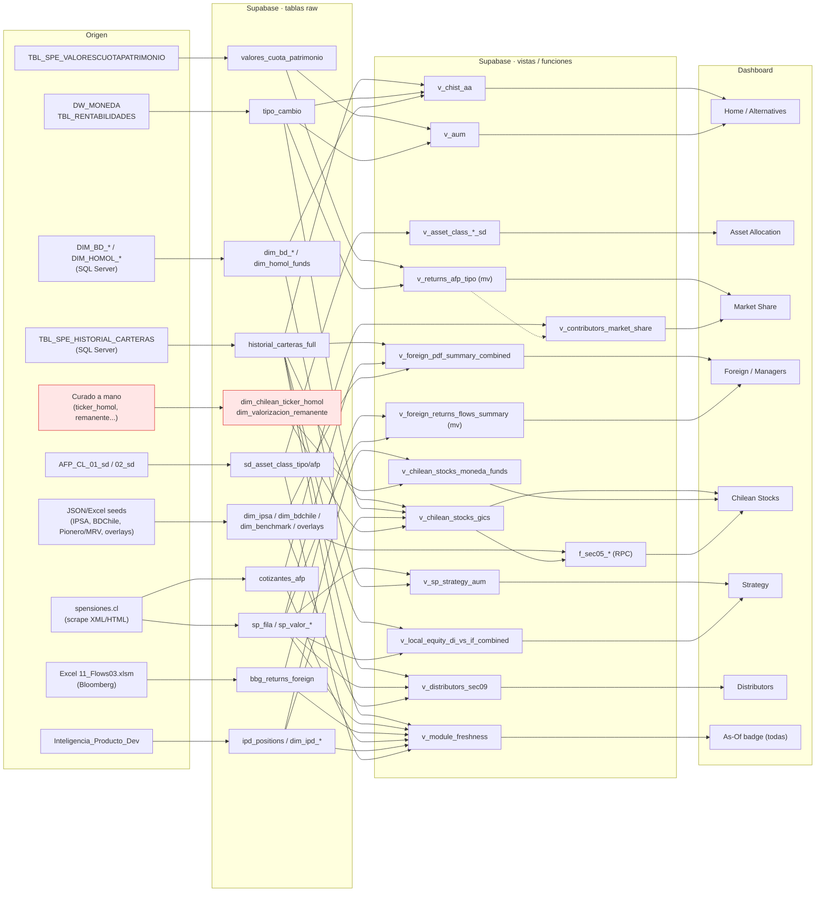

# Data Lineage — AFP Chile Dashboard

> De dónde vienen los datos que alimentan cada sección del dashboard, capa por capa.
>
> **Cómo se construyó este mapa** (no es graphify — es un cruce a medida de tres fuentes):
> 1. **Capa consumidora** — grep de `.from('…')` / `.rpc('…')` en `web/lib/queries-*.ts` y qué página los importa.
> 2. **Capa intermedia** — dependencias `vista → tabla base` extraídas del catálogo de Postgres (`pg_depend`/`pg_rewrite`) del proyecto Supabase `ProjectAFP_v2` (`vmehawqqhcyhxyaoznpc`), más los cuerpos de las funciones `f_sec05_*`.
> 3. **Capa productora** — lectura de `sync/*.py`: qué tabla Supabase escribe cada script y desde qué tabla de SQL Server / Excel / JSON.
>
> _Generado 2026-06-24. Si cambian las vistas o los syncs, regenerar repitiendo esos tres pasos._

---

## La cadena completa

```
ORIGEN                         SQL SERVER / EXCEL / SCRAPE        SUPABASE (tabla raw)      SUPABASE (vista/función)      DASHBOARD
─────────────────────────────────────────────────────────────────────────────────────────────────────────────────────────────────
TBL_SPE_HISTORIAL_CARTERAS ──► (pilot_sync_full.py) ───────────► historial_carteras_full ─► v_chist_aa, v_chilean_…   ─► page.tsx
spensiones.cl (XML)        ──► AFP_CL_SP_* (sync_sp_xml.py) ───► sp_fila/sp_valor_* ──────► v_sp_* ───────────────────► foreign/…
Equipo (carga a SQL)       ──► AFP_CL_Cotizantes ─────────────► cotizantes_afp ──────────► v_contributors_…  ─────────► market-share
Excel 11_Flows03.xlsm      ──► AFP_CL_BBG_Returns_Foreign ────► bbg_returns_foreign ─────► v_foreign_returns_flows ───► foreign
DW_MONEDA TBL_RENTABILIDADES─► (sync_sqlserver…) ─────────────► tipo_cambio ─────────────► (casi todas) ──────────────► (todas)
Inteligencia_Producto_Dev  ──► (sync_inteligencia_producto) ──► ipd_positions, dim_ipd_* ► v_chilean_stocks_* ────────► chilean-stocks
Excel/JSON seeds           ──► (load_*.py) ───────────────────► dim_ipsa/bdchile/benchmark► f_sec05_* ─────────────────► chilean-stocks
```

El detalle por sección está abajo. Las **funciones RPC** `f_sec05_*` y las **vistas materializadas** `mv_*` (que el dashboard refresca, no recalcula en vivo) están marcadas.

## Diagrama visual



> 🔴 En rojo: los datos **curados a mano sin sync** (ver tabla de huecos al final).

---

## Linaje por sección del dashboard

### Home / Alternatives — `web/app/page.tsx`
`queries.ts`, `queries-alternatives.ts`

| Vista que lee el dashboard | Cadena de vistas | Tablas base | Origen |
|---|---|---|---|
| `v_total`, `v_total_c1`, `v_uncalled`, `v_nav`, `v_afp_c1`, `v_afp_c2` | → `v_chist_aa` | `historial_carteras_full`, `tipo_cambio`, `dim_bd_funds`, `dim_homol_funds`, `dim_tipo_instrumento_filtro`, `dim_valorizacion_remanente` | CHIST (SQL Server, sin filtro) + DW_MONEDA FX + dimensionales |
| `v_aum` | (directa) | `valores_cuota_patrimonio`, `tipo_cambio` | `TBL_SPE_VALORESCUOTAPATRIMONIO` + FX |

### Asset Allocation — `web/app/asset-allocation/page.tsx`
`queries-asset-allocation.ts`

| Vista | Tablas base | Origen |
|---|---|---|
| `v_asset_class_tipo_sd`, `v_asset_class_dates_sd` | `sd_asset_class_tipo` | `AFP_CL_01_sd` (SQL Server, `sync_sd_asset_class.py`) |
| `v_asset_class_afp_sd`, `v_local_fi_by_afp_sd` | `sd_asset_class_afp` | `AFP_CL_02_sd` (SQL Server, `sync_sd_asset_class.py`) |

### Market Share — `web/app/market-share/page.tsx`
`queries-market-share.ts`

| Vista | Cadena | Tablas base | Origen |
|---|---|---|---|
| `v_returns_afp_tipo` | → `mv_returns_afp_tipo` → `v_cuota_month_end` + `v_daily_flows` | `valores_cuota_patrimonio`, `tipo_cambio` | `TBL_SPE_VALORESCUOTAPATRIMONIO` + FX **(matview — se refresca)** |
| `v_contributors_market_share` | → `cotizantes_afp` + `v_returns_afp_tipo` | `cotizantes_afp` (+ las de arriba) | `AFP_CL_Cotizantes` (mantenida por el equipo; antes scrape → `AFP_CL_SP_Cotizantes`, retirado 2026-07) |

### Foreign — `web/app/foreign/page.tsx`
`queries-foreign.ts`, `queries-foreign-di.ts`, `queries-foreign-evolution.ts`, `queries-foreign-latam.ts`

Esta sección **combina dos fuentes** (CHIST + SP XML) por diseño.

| Vista | Tablas base (resueltas) | Origen |
|---|---|---|
| `v_foreign_pdf_summary_combined` | `historial_carteras_full`, `sp_fila`/`sp_valor_fondo`, `bbg`?, `tipo_cambio`, `dim_bd_*`, `dim_homol_funds`, `dim_foreign_classification_overlay`, `dim_foreign_region_override`, `dim_direct_investment_overlay` | CHIST + SP XML + overlays manuales/JSON |
| `v_foreign_returns_flows_summary` | → `v_foreign_returns_flows` → `bbg_returns_foreign` + SP | Excel `11_Flows03.xlsm` (Bloomberg) + SP XML **(matview)** |
| `v_foreign_fund_flows` | → `mv_foreign_fund_flows` → `bbg_returns_foreign`, `dim_bd_funds`, `dim_homol_funds`, SP | Bloomberg + SP **(matview)** |
| `v_foreign_managers_combined` | CHIST managers (`mv_chist_foreign_managers`) + SP managers | `historial_carteras_full` + `sp_*` + `dim_bd_funds` |
| `mv_sp_direct_investment_detail` | → `v_sp_direct_investment_detail` → `sp_fila`, `sp_valor_fondo`, `dim_direct_investment_overlay` | SP XML + `di_overlay.json` **(matview)** |
| `mv_foreign_latam_monthly` | → `v_foreign_latam_monthly` → `historial_carteras_full`, `tipo_cambio`, overlays | CHIST + FX **(matview)** |

### Managers — `web/app/managers/page.tsx`
`queries-foreign.ts` → `v_foreign_pdf_summary_combined`, `v_foreign_managers_combined` (mismas cadenas que Foreign). **+ `dim_data_sources`** vía el widget `SourceBadge`.

### Strategy — `web/app/strategy/page.tsx`
`queries-strategy.ts`, `queries-strategy-attribution.ts`

| Vista | Tablas base | Origen |
|---|---|---|
| `dim_bd_family` | (directa) | `DIM_BD_Family` (SQL Server) |
| `v_sp_strategy_aum` | `sp_fila`/`sp_valor_*` + `dim_bd_family`, `dim_bd_family_comp`, `dim_bd_funds`, `dim_homol_funds` | SP XML + dimensionales BD |
| `v_local_equity_di_vs_if_combined` | CHIST (`historial_carteras_full`) + SP (`sp_*`) + `tipo_cambio` + `dim_bd_funds`/`dim_homol_funds` | CHIST + SP XML + FX |
| `dim_strategy_ipd_funds` (directa) | mapping estático family → `ID_Fund` IPD (NO join por nombre) | seed en migration `strategy_41_42_ipd_tables` |
| `ipd_cartera_eom`, `ipd_attribution_monthly`, `ipd_attribution_fund_month` (directas) | agregados mensuales precalculados por `sync/sync_ipd_strategy.py` — el diario (`TBL_IPA_V2`, dedupe `FechaReporte=FechaCartera`) nunca toca Supabase | Inteligencia_Producto (Geneva/UBS diario) |
| `ipd_rentabilidades` (directa) | `TBL_RENTABILIDADES_SERIES` parseada (fondos estrategia; serie vs benchmark, USD/CLP) | Inteligencia_Producto |

### Chilean Stocks — `web/app/chilean-stocks/page.tsx`
`queries-chilean-stocks.ts`, `queries-sec05.ts`

| Vista / función | Tablas base | Origen |
|---|---|---|
| `v_chilean_stocks_gics` | `historial_carteras_full`, `tipo_cambio`, `dim_ipd_gics`, `dim_ipd_instrumentos`, `dim_chilean_ticker_homol`, `dim_chilean_stocks_gics_override` | CHIST + FX + Inteligencia_Producto + overrides manuales |
| `mv_chist_chilean_stocks_by_nemo` | `historial_carteras_full` | CHIST **(matview)** |
| `tipo_cambio` (directa) | `tipo_cambio` | DW_MONEDA FX |
| `f_sec05_size`, `f_sec05_ipsa_membership`, `f_sec05_concentration`, `f_sec05_top40` **(RPC)** | `ipd_cartera_eom` (Pionero 33 / MRV 19, `investment_type_code=2`), `ipd_bms_membership` (IGPA 16 / IGPAL 17 / IGPAM 18 / IGPAS 19 / IPSA 20), `v_chilean_stocks_gics`, `dim_bdchile` (solo company/grupo) | **SQL vivo** (TBL_IPA_V2 + TBL_BMS_Exposicion vía `sync_ipd_strategy.py`) + CHIST. Cuartiles→SIZE 2026-07-01; sin seeds JSON |
| `dim_data_sources` (vía `SourceBadge`) | `dim_data_sources` | metadata de procedencia (`load_*.py`) |

> 2026-07-01: `v_chilean_stocks_moneda_funds`, `ipd_positions`, `dim_benchmark_composition` y `dim_ipsa_composition` fueron **eliminadas** (reemplazadas por `ipd_cartera_eom` + `ipd_bms_membership`, −28 MB).

### Distributors — `web/app/distributors/page.tsx`
`queries-distributors.ts`

| Vista | Tablas base | Origen |
|---|---|---|
| `v_distributors_sec09` | `historial_carteras_full`, `v_sp_foreign_classified` (→ `sp_*`), `dim_foreign_classification_overlay` | CHIST + SP XML + overlay JSON |

### Admin · Data Sources — `web/app/admin/data-sources/page.tsx`
`queries-data-sources.ts` → `dim_data_sources` (metadata de frescura/origen, mantenida por los `load_*.py`).

### Badge de frescura (en todas las páginas) — `components/as-of-badge`
`queries-freshness.ts` → `v_module_freshness` → lee `MAX(fecha)` de: `historial_carteras`, `historial_carteras_full`, `valores_cuota_patrimonio`, `tipo_cambio`, `sp_fila`, `cotizantes_afp`, `sd_asset_class_tipo`, `bbg_returns_foreign`, `ipd_positions`.

---

## Referencia: tabla base Supabase → origen

| Tabla base (Supabase) | Script de sync | Origen último | Estrategia |
|---|---|---|---|
| `historial_carteras` | `sync_sqlserver_to_supabase.py` | `TBL_SPE_HISTORIAL_CARTERAS` JOIN `AFP_CL_DIM_TipoInstrumentoF1` **(filtro `Filtro1='Si'`, solo alternativos)** | DELETE por `fecha_reporte` + INSERT |
| `historial_carteras_full` | `pilot_sync_full.py` | `TBL_SPE_HISTORIAL_CARTERAS` (sin filtro, universo completo) | DELETE + INSERT por mes |
| `valores_cuota_patrimonio` | `sync_sqlserver_to_supabase.py` | `TBL_SPE_VALORESCUOTAPATRIMONIO` | UPSERT `(fecha, multifondo, afp)` |
| `tipo_cambio` | `sync_sqlserver_to_supabase.py` | `DW_MONEDA.TBL_RENTABILIDADES_DW` (`CLFXDOOB_sindesf`, `USDCLP Curncy`) | UPSERT `(fecha, instrumento_codigo)` |
| `sp_fila`, `sp_valor_fondo`, `sp_valor_afp`, `sp_valor_instrumento` | `sync_sp_sqlserver_to_supabase.py` ← `sync_sp_xml.py` | `AFP_CL_SP_*` ← scrape XML `spensiones.cl` | mirror 1:1 (≥2025-01), `fila_id` preservado |
| `cotizantes_afp` | `sync_sp_sqlserver_to_supabase.py` | `AFP_CL_Cotizantes` (mantenida por el equipo; antes `AFP_CL_SP_Cotizantes` ← scrape, retirado 2026-07) | DELETE ventana + INSERT |
| `sd_asset_class_tipo` | `sync_sd_asset_class.py` | `AFP_CL_01_sd` (SQL Server) | DELETE por `fecha` + INSERT |
| `sd_asset_class_afp` | `sync_sd_asset_class.py` | `AFP_CL_02_sd` (SQL Server) | DELETE por `fecha` + INSERT |
| `bbg_returns_foreign` | `sync_bbg_returns_to_supabase.py` ← `extract_bbg_returns.py` | `AFP_CL_BBG_Returns_Foreign` ← Excel `11_Flows03.xlsm` hoja Rentab | UPSERT `(fecha, nemo)` |
| `dim_bd_funds` (+ cols `nt_*`) | `sync_sqlserver_to_supabase.py` (+ `load_bd_funds_nt.py`) | `DIM_BD_FUNDS_2_INTMDO` (+ `BD_Funds.xlsx` para `nt_*`) | UPSERT full reload |
| `dim_homol_funds` | `sync_sqlserver_to_supabase.py` | `DIM_HOMOL_FUNDS_INTMDO` (filtrado por Source) | UPSERT `(name, source)` |
| `dim_tipo_instrumento_filtro` | `sync_sqlserver_to_supabase.py` | `AFP_CL_DIM_TipoInstrumentoF1` | UPSERT full reload |
| `dim_tipo_instrumento_sp` | `sync_sqlserver_to_supabase.py` | `TBL_SPE_TIPOS_INSTRUMENTOS` | UPSERT `codigo` |
| `dim_bd_family`, `dim_bd_family_comp`, `dim_bd_direct_inv_lics`, `dim_bd_asset_class`, `dim_bd_category`, `dim_bd_region`, `dim_bd_ac_reg_cat`, `dim_rel_feeder_master` | `sync_sqlserver_to_supabase.py` | `DIM_BD_*` / `AFP_CL_DIM_Family_Comp` (SQL Server) | UPSERT full reload |
| `dim_ipd_gics`, `dim_ipd_instrumentos`, `ipd_positions`, `dim_ipd_*`, `ipd_*` | `sync_inteligencia_producto.py` | `Inteligencia_Producto_Dev` (schemas `dimensionales`/`extract`/`process`/`metrics`) | DELETE-all + INSERT |
| `dim_ipsa_composition`, `dim_mkt_cap_chilean`, `dim_benchmark_composition` | `excel/seed/load_sec05_misc.py` | JSON `ipsa.json` / `mkt_cap.json` / `benchmark_composition.json` (Pionero+MRV) | DELETE-all + INSERT |
| `dim_bdchile` | `excel/seed/load_bdchile.py` | JSON `bdchile.json` (← Excel legacy) | DELETE-all + INSERT |
| `dim_sec08_top_flows` | `excel/seed/load_sec08_flows.py` | JSON `sec08_flows.json` | DELETE-all + INSERT |
| `dim_direct_investment_overlay` | `load_di_overlay.py` | JSON `di_overlay.json` | Truncate + INSERT |
| `dim_foreign_classification_overlay` | `load_foreign_overlay.py` | JSON `foreign_overlay.json` | Truncate + INSERT |
| `dim_valorizacion_remanente`, `dim_chilean_ticker_homol`, `dim_chilean_stocks_gics_override`, `dim_foreign_region_override` | **— (sin script de sync)** | **Mantenidas a mano en Supabase** | manual |

---

## Componentes transversales (verificado 2026-06-24)

Auditoría profunda ruta-por-ruta (trazando el árbol completo de componentes, no solo el `page.tsx`). Dos widgets compartidos inyectan lecturas que **no** aparecen en el `import` del page:

- **`AsOfBadge`** (`web/components/as-of-badge.tsx`) → lee **`v_module_freshness`** en **TODAS** las secciones. Es un server component que hace su propio fetch (cache 60s). No es un módulo del dashboard, es el badge de frescura presente en cada página.
- **`SourceBadge`** (`web/components/source-badge.tsx`) → lee **`dim_data_sources`** en **Admin, Managers y Chilean Stocks** (donde se muestra el origen del dato). También self-fetch con cache 60s.

`dim_data_sources` es metadata de procedencia (`last_loaded_at`, AUTO/MANUAL) que mantienen los scripts `load_*.py` al cargar los seeds — no tiene fuente externa.

> Confirmado además: la sección **Asset Allocation** nace exclusivamente de `v_asset_class_*_sd` / `v_local_fi_by_afp_sd` → `sd_asset_class_*` → `AFP_CL_01_sd/02_sd`. Los docstrings de `queries-asset-allocation.ts` que dicen "SP XML / v_sp_asset_class_*" están **desactualizados** (pre-migración de mayo); el código real lee las vistas `_sd`.

## Notas y huecos

- **Las 4 tablas sin sync** se editan directo en Supabase. Auditadas 2026-06-24 — no todas son iguales:

  | Tabla | Filas | ¿Versionada en el repo? | Estado |
  |---|---|---|---|
  | `dim_chilean_stocks_gics_override` | 6 | ✅ `sync/chilean_stocks_gics_override.sql` (migration 2026-05-28) | Curada a mano, pero DDL+seed versionados. OK. |
  | `dim_foreign_region_override` | 1 | ⚠️ La vista consumidora (`sync/sp_foreign_apply_overlay.sql`) está versionada; la fila de datos es insertada a mano (col `created_at`) | Semi-documentada. |
  | `dim_chilean_ticker_homol` | 75 | ❌ Sin DDL/seed en el repo (solo aparece como JOIN en `v_chilean_stocks_gics`) | **Hueco real**: homologación nemo→ticker BBG cargada a mano, sin respaldo versionado. |
  | `dim_valorizacion_remanente` | 16 | ❌ Salta a propósito el sync (`sync_sqlserver_to_supabase.py:30,515`), documentada en CLAUDE.md | Manual conocido, sin fuente en SQL Server. |

  El riesgo concentrado está en **`dim_chilean_ticker_homol`**: 75 filas que mapean nemotécnicos chilenos a tickers Bloomberg, sin seed en el repo — si se pierde la tabla en Supabase no hay forma de reconstruirla desde código. Recomendado: dumpear sus filas a un `.sql`/`.json` versionado.
- **Vistas materializadas (`mv_*`)**: el dashboard lee el snapshot, no recalcula. Si los datos base cambian hay que `REFRESH MATERIALIZED VIEW` (ver `sync/refresh_mv.py`). Afecta: market-share, foreign, chilean-stocks.
- **CHIST tiene dos copias**: `historial_carteras` (solo alternativos, filtro `Filtro1='Si'`) y `historial_carteras_full` (universo completo). El dashboard nuevo usa casi siempre `_full`; `historial_carteras` queda para los cubos legacy de alternativos.
- **Doble origen Foreign/Strategy**: las vistas `*_combined` unen CHIST (`historial_carteras_full`) con SP XML (`sp_*`). Por eso una misma sección depende de dos pipelines distintos.
- Funciones `f_sec05_*`: las relaciones reales son `dim_benchmark_composition`, `dim_ipsa_composition`, `dim_bdchile`, `v_chilean_stocks_gics`; el resto de nombres en sus cuerpos son CTEs internos.
